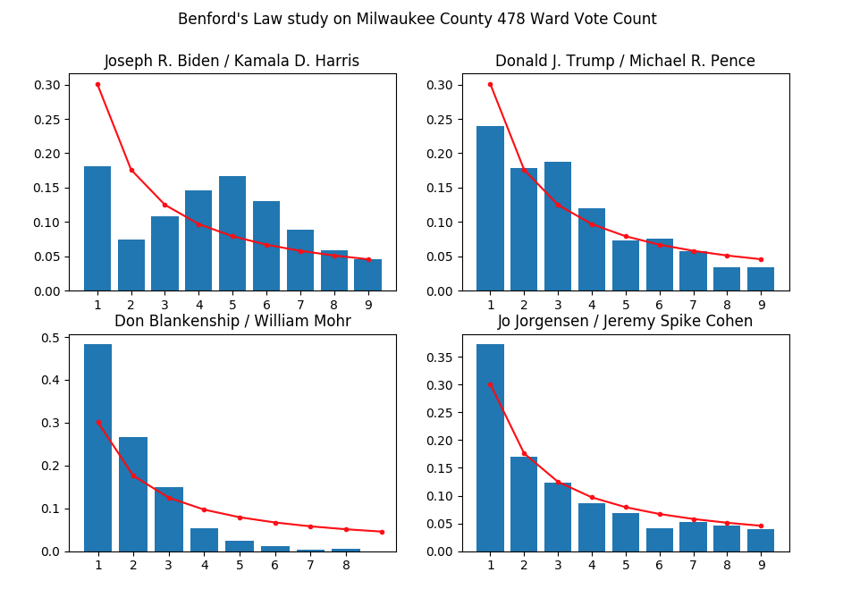

What
====

I did an indepdent study on public available data from 2020 Wisconsin voting general election. Two studies has been coudcted:

1. Abnormal voter turnout state-wide and county-wide.
1. Abnormal vote count in Milwaukee County.

Abnormal Voter Turnout
======================

This Python notebook caculates WI 2020 General Election turn out. All data is public from below:

- WI voters count per county in 2020 General Election from WSJ [WI-county.json](https://www.wsj.com/election-results-2020-data/president/WI-county.json)
- [County FIPS code](https://github.com/kjhealy/fips-codes)
- WI registered voter on 11/01/2020 [RegisteredVotersByCounty_11-01-2020.xlsx](https://elections.wi.gov/sites/elections.wi.gov/files/2020-11/RegisteredVotersByCounty_11-01-2020.xlsx)
- WI voters count per county in 2016 General Election [County by County Report President of the United States Recount.xlsx](https://elections.wi.gov/sites/elections.wi.gov/files/County%20by%20County%20Report%20President%20of%20the%20United%20States%20Recount.xlsx)
- WI registered voter on 11/16/2016 [registeredvotersbycounty_xlsx_13527.xlsx](https://elections.wi.gov/sites/elections.wi.gov/files/publication/registeredvotersbycounty_xlsx_13527.xlsx)

It shows extremely high voter turnout:

```
           county_name   votes  Registered Voters  turn_out
50        Price County    8642               9055  0.954390
60       Taylor County   10678              11294  0.945458
38    Marquette County    9050               9579  0.944775
28       Juneau County   13683              14567  0.939315
6       Burnett County   10138              10795  0.939138
54         Rusk County    7879               8396  0.938423
69     Waushara County   13564              14465  0.937712
42       Oconto County   23211              24759  0.937477
46        Pepin County    4138               4414  0.937472
58      Shawano County   22878              24408  0.937316
30     Kewaunee County   12066              12926  0.933467
7       Calumet County   30797              33050  0.931831
66   Washington County   88026              94481  0.931679
19  Fond du Lac County   57193              61390  0.931634
5       Buffalo County    7798               8405  0.927781
32    Lafayette County    8547               9214  0.927610
11     Crawford County    8695               9378  0.927170
68      Waupaca County   29081              31369  0.927062
22        Green County   21351              23061  0.925849
48         Polk County   26318              28431  0.925680
8      Chippewa County   35908              38859  0.924059
23   Green Lake County   10644              11524  0.923638
13        Dodge County   48415              52433  0.923369
9         Clark County   14866              16113  0.922609
24         Iowa County   13961              15136  0.922371
3      Bayfield County   10876              11795  0.922086
0         Adams County   11806              12805  0.921984
52     Richland County    9005               9779  0.920851
55    St. Croix County   56542              61464  0.919921
14         Door County   20076              21826  0.919820
45      Ozaukee County   61244              66641  0.919014
43       Oneida County   24111              26248  0.918584
41       Monroe County   22560              24565  0.918380
65     Washburn County   10353              11278  0.917982
61  Trempealeau County   15341              16714  0.917853
67     Waukesha County  267159             291183  0.917495
10     Columbia County   33847              36898  0.917313
18     Florence County    2939               3205  0.917005
34      Lincoln County   16496              18001  0.916394
2        Barron County   25316              27632  0.916184
62       Vernon County   15907              17364  0.916091
21        Grant County   25333              27685  0.915044
56         Sauk County   36172              39544  0.914728
33     Langlade County   11156              12200  0.914426
25         Iron County    4031               4412  0.913645
35    Manitowoc County   44477              48688  0.913511
27    Jefferson County   47860              52395  0.913446
59    Sheboygan County   65855              72138  0.912903
71         Wood County   41196              45206  0.911295
44    Outagamie County  107956             118689  0.909570
36     Marathon County   76603              84288  0.908825
16         Dunn County   23526              25969  0.905926
26      Jackson County   10179              11267  0.903435
63        Vilas County   15338              17003  0.902076
64     Walworth County   57441              63729  0.901332
49      Portage County   40510              44977  0.900683
15      Douglas County   24595              27308  0.900652
57       Sawyer County   10463              11623  0.900198
70    Winnebago County   93790             104233  0.899811
37    Marinette County   22959              25527  0.899401
47       Pierce County   23260              25910  0.897723
1       Ashland County    8728               9770  0.893347
17   Eau Claire County   58069              65337  0.888761
4         Brown County  143623             162076  0.886146
39    Menominee County    1585               1789  0.885970
51       Racine County  106148             119988  0.884655
29      Kenosha County   88467             100331  0.881751
31    La Crosse County   67609              76830  0.879982
12         Dane County  343599             390887  0.879024
20       Forest County    5050               5761  0.876584
53         Rock County   85150              97177  0.876236
40    Milwaukee County  457318             557089  0.820907
```

Among democratic countries in the West, only the country like Belgium and Australia, which has a compulsory law to require registered voters to vote, has the highest turnout 87%.

[See source](https://www.weforum.org/agenda/2018/11/these-countries-have-some-of-the-highest-voter-turnout-in-the-world/)

We should have voting record by now whether the registered voters have casted ballot or not.

We only need to sample 1,000 registered voters and ask them if they have casted the ballot LEGALLY or not to verify  if the turnout is too good to be true.

Benford's Law Shows Abnormal Vote Count in Milwaukee County Ward
================================================================

In statistics, there is an interesting number law called [Benford's Law](https://en.wikipedia.org/wiki/Benford%27s_law). The idea is simple: in many naturally occurring collections of numbers, the leading digit is likely to be small.

For example, the number 1 appears as the leading significant digit about 30% of the time, while 9 appears as the leading significant digit less than 5% of the time. The distribution of the leading number decrease exponentially.

Everyone's vote count follow Benford's Law except Joe Biden. This should raise **a red flag** and deserve further **investigation**.


